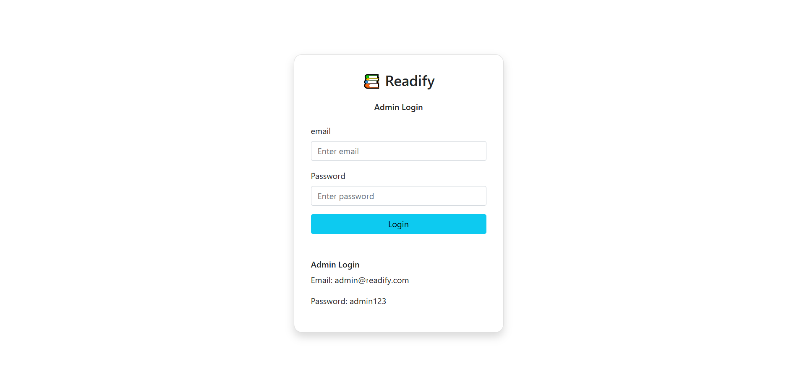
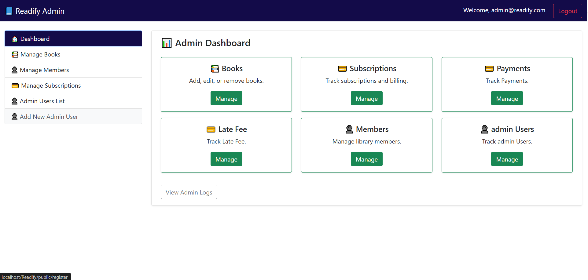
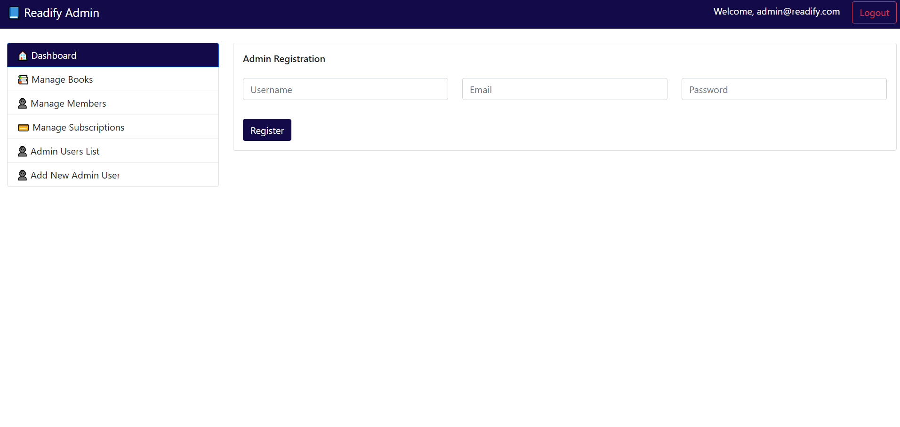

# Readify - Library Management System (LMS) with Subscription System

**Readify** is a comprehensive Library Management System (LMS) designed to manage books, members, and subscriptions in a modern and intuitive way. It offers features such as member registration, book management, a subscription system, and advanced user profile management.

## Features

- **Member Registration**: Allows new members to sign up and access the library system.
- **Login/Logout**: Secure authentication for members to log in and access their accounts.
- **Profile Management**: Members can manage their personal details, change passwords, and update preferences.
- **Book Management**: Add, update, and remove books from the library system.
- **Subscription System**: Allows members to subscribe to various book categories, receive updates, and manage subscriptions.

## Technologies Used

- **Backend**: PHP
- **Frontend**: html
- **Database**: MySQL
- **Authentication**: PHP
- **Version Control**: Git & GitHub

## Installation

### Prerequisites

Make sure you have the following installed:

- PHP >= 7.4
- Composer
- MySQL

### Step 1: Clone the Repository

```bash
git clone https://github.com/sharifWebDev/Readify.git
```

```bash
cd Readify
```

### How to run

open browser and open browser in project index file

### How to manage project git

--add change--

```bash
git add .
```

commit change

```bash
git commit -m "Yout change name"
```

--push change to branch name--

```bash
git push origin develop
```

File structure

admin-login-app/
├── config/
│ └── Database.php
├── core/
│ ├── Controller.php
│ ├── Model.php
│ └── CSRF.php
├── controllers/
│ └── AuthController.php
├── models/
│ └── Admin.php
├── views/
│ ├── login.php
│ └── dashboard.php
├── routes/
│ └── web.php
├── public/
│ ├── index.php
│ └── .htaccess
└── composer.json (optional)


````
login
````




````
Admin Dashboard
````




````
Admin User List
````


````
Register Admin User
````



````
Books List
````

